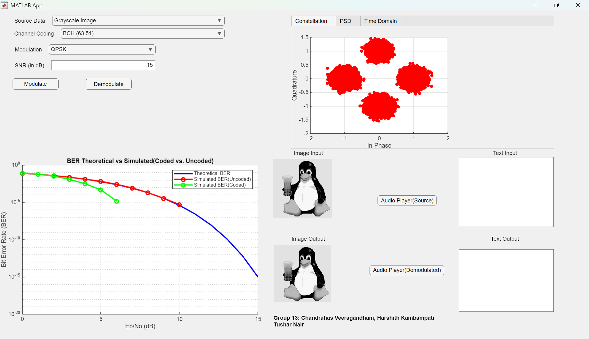
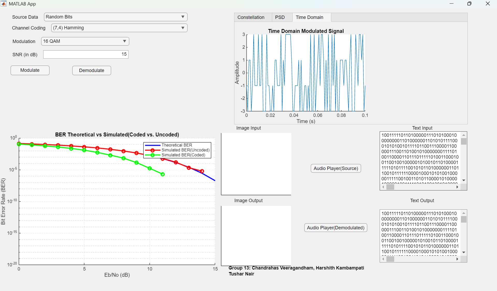

# Digital-Communications-System-on-MATLAB  

This repository features a Digital Communication System developed using MATLAB App Designer. It was created as a course project for **EEE F416 - Digital Communication** to simulate and analyze essential aspects of digital communication with an intuitive graphical user interface (GUI).  

## Features  

Users can input or generate data using one of the following options:  
1. Generate random bits.  
2. Select a text file (.txt file).  
3. Select a grayscale image (.jpg or .png or.bmp file).  
4. Select an audio signal (.wav or .mp3 file).  

### Channel Coding  
The system supports three codes for channel coding:  
1. (7,4) Hamming Code.  
2. BCH (127,64) Code.  
3. BCH (63,51) Code.  

### Modulation Schemes  
The following modulation techniques are implemented:  
1. QPSK.  
2. 16 QAM.  
3. 64 QAM.  
4. 16 FSK.  
5. 64 FSK.  

### Visualizations  
The system provides the following visual representations of the transmitted data:  
1. Constellation diagrams for all modulation schemes.  
2. Time-domain signal plots.  
3. Power Spectral Density (PSD) plots.  

### Noise Addition  
Users can add Additive White Gaussian Noise (AWGN) to the signal at different Signal-to-Noise Ratio (SNR) values for analysis.  

### Demodulation and Reconstruction  
- Demodulates the received symbols and converts them back into bits.  
- Reconstructs text, images, and audio signals, allowing users to view/play the results for different SNR values.  

### BER Analysis  
- Plots Bit Error Rate (BER) curves to compare theoretical and simulated performance, both with and without channel coding.

## Requirements  

To run the project, ensure you have the following:  
- MATLAB R2022b or later.  
- Signal Processing Toolbox.  
- Communications Toolbox.  
